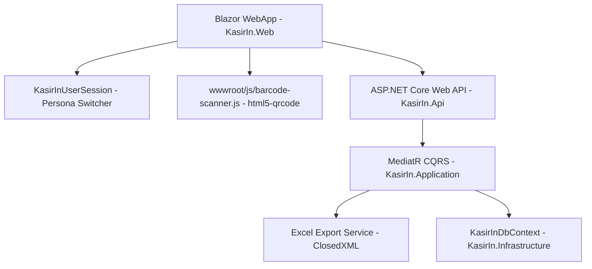

# Design Specification: KasirIn Hybrid Portfolio Upgrade

**Date:** 2026-08-14  
**Project:** KasirIn (C# .NET 8 Cloud POS & Financial Bookkeeping System)  
**Status:** Approved  

---

## 1. Overview & Objectives

KasirIn is a modern C# .NET 8 Clean Architecture Cloud POS and Financial Bookkeeping application tailored for local Indonesian micro-enterprises (UMKM). This upgrade enhances the platform into an elite portfolio project showcasing senior-level engineering, real-world utility, and clean UX design.

### Core Upgrades
1. **Live Camera Barcode Scanner**: In-browser real-time camera barcode scanning via JavaScript Interop (`html5-qrcode`) with audio feedback.
2. **Professional Excel Report Generator**: Backend `.xlsx` export via `ClosedXML` with multi-sheet tabbed formatting.
3. **Role-Based Access Control (RBAC) & Persona Switcher**: Topbar persona toggle (`CASHIER` vs `OWNER`) governing data privacy and navigation boundaries.

---

## 2. System Architecture & Components

### Component Details

#### 2.1 Live Camera Barcode Scanner
- **Location**: `KasirIn.Web/wwwroot/js/barcode-scanner.js` & `KasirIn.Web/Components/Pages/POSCashier.razor`.
- **Library**: `html5-qrcode` CDN integration.
- **Behavior**:
  - Toggling "Scan Kamera" opens a modal overlay with live camera feed.
  - Upon scanning a valid SKU barcode (e.g., `SNK-001`), plays a Web Audio API beep sound (800Hz, 150ms).
  - Automatically matches product in `_products`, adds 1 unit to cart, and closes modal.

#### 2.2 Excel Report Exporter (`ClosedXML`)
- **Package**: `ClosedXML` added to `KasirIn.Infrastructure` / `KasirIn.Application`.
- **Endpoint**: `GET /api/reports/export-excel` in `ReportsController.cs`.
- **File Structure (`KasirIn_Laporan_Keuangan.xlsx`)**:
  - **Sheet 1: Rekap Keuangan**: Total Revenue, HPP Cost, Net Profit, Transaction Count.
  - **Sheet 2: Riwayat Penjualan**: Detailed table of transactions (Invoice, Date, Items, Total, Payment Method).
  - **Sheet 3: Buku Kasbon Utang**: Customer debt records (Name, Phone, Total Debt, Paid, Remaining, Status).

#### 2.3 Role-Based Access Control (RBAC Persona Switcher)
- **Service**: `KasirInUserSession` singleton registered in `KasirIn.Web`.
- **Roles**:
  - **`CASHIER`**: Can access `/pos` and `/inventory` (HPP/Cost price hidden). Hides `/reports` and `/dashboard` financial cards.
  - **`OWNER`**: Full unrestricted access to all pages, cost prices, profit margins, and Excel export.

---

## 3. UI/UX Design System (UI UX Pro Max Standard)

- **Color Tokens**:
  - Primary: `#004ac6` (Stitch Enterprise Blue)
  - Surface: `#f8f9ff` (Soft Ice White)
  - WhatsApp Accent: `#25D366`
  - High Contrast Active Buttons: `#ffffff` text on `#004ac6` background.
- **Typography**: Inter font with tabular numbers (`tabular-nums`) for currency and quantities.

---

## 4. Verification Strategy

1. **Unit Tests**: Run `dotnet test KasirIn.sln` to ensure all 18+ tests pass.
2. **Compilation**: Run `dotnet build KasirIn.sln` ensuring zero warnings/errors.
3. **End-to-End Playwright Tests**: Run `test_kasirin_e2e.py` verifying POS cashier, camera scanner trigger, Excel download API response, and persona role switching.
